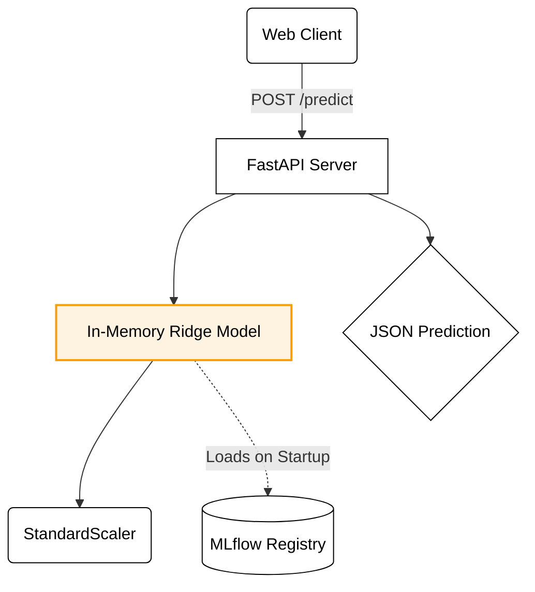

# Brake Thermal Efficiency Predictor 🚗⚡

This project is a FastAPI-based web service that predicts **Brake Thermal Efficiency (BTE)** for Internal Combustion Engines. It integrates a complete MLOps lifecycle from data processing to Hugging Face Space deployment, serving as a robust portfolio demonstration of production-grade Machine Learning Engineering.

---

## 🏗 Architecture & Skills Highlighted

### 🛠 Tech Stack
- **Backend**: FastAPI, Python 3.14
- **Machine Learning**: Scikit-Learn (Ridge Regression), Pandas, GridSearchCV
- **MLOps**: MLflow (Experiment Tracking & Model Registry)
- **Deployment**: Docker (Multi-stage builds, non-root user), Hugging Face Spaces
- **Frontend**: Vanilla JS, HTML, CSS, Mermaid.js (for dynamic architecture diagrams)

### 🔄 MLOps Pipeline Flow


---

## 🧰 Setup Instructions

### 1. Clone the Repo & Setup Virtual Environment (Requires Python 3.14.4)
```bash
python3.14 -m venv venv
source venv/bin/activate  # Windows: venv\Scripts\activate
```

### 2. Install Dependencies
```bash
pip install -r requirements.txt
```

### 3. Train the Model
```bash
python train.py
```
This will:
- Train a Ridge Regression model with cross-validation
- Save `model.pkl` and `scaler.pkl` in `./models/`
- Display best hyperparameters and training time

### 4. Start the FastAPI App
```bash
uvicorn main:app --host 0.0.0.0 --port 5000
```
Server will run at `http://127.0.0.1:5000/`

---

## 📡 API Endpoints
### ✅ GET / or GET /home
Renders the main web interface with the prediction form.
Returns the index.html template.

### ✅ GET /status
Checks and returns the backend's operational status and model availability.

Response:
{
  "message": "✅ Backend and models are ready.",
  "status": "ok"
}
(Or "warning" if models not found, or "error" if an exception occurs)

### 🧠 POST /predict
Accepts engine parameters as JSON and returns the predicted BTE.

Required JSON Body:
{
  "engine_load": 75,
  "fuel_blend_percentage": 30.0,
  "nanoparticle_concentration": 45.5,
  "injection_pressure": 220,
  "engine_speed": 1800
}
Response:

{
  "predicted_BTE": 25.831
}

Error Responses:
422 Unprocessable Entity: If required fields are missing or have wrong value types.

500 Internal Server Error: For other server-side errors during prediction (e.g., data type conversion issues, model loading errors).
---

## ✅ Test Cases

### 1. Valid Input (Positive Case)
```json
{
  "engine_load": 75,
  "fuel_blend_percentage": 30.0,
  "nanoparticle_concentration": 45.5,
  "injection_pressure": 220,
  "engine_speed": 1800
}
```
✔ Expected: Returns `predicted_BTE` value

### 2. Missing Key (Negative Case)
```json
{
  "engine_load": 75,
  "fuel_blend_percentage": 30.0,
  "injection_pressure": 220,
  "engine_speed": 1800
}
```
❌ Expected: 422 Error - Validation error

### 3. Wrong Value Types (Edge Case)
```json
{
  "engine_load": "high",
  "fuel_blend_percentage": "thirty",
  "nanoparticle_concentration": 45.5,
  "injection_pressure": 220,
  "engine_speed": 1800
}
```
❌ Expected: 422 Error - Validation error

### 4. Empty Body (Edge Case)
```json
{}
```
❌ Expected: 422 Error - Validation error

---

## 🧾 License
This project is part of the coursework.
Feel free to fork and adapt for educational use.
